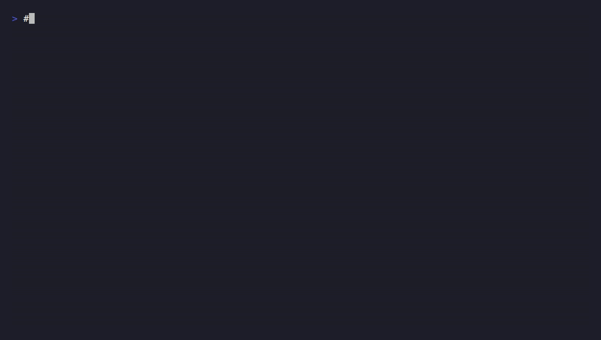

# detkit — dbt for detections

[](https://github.com/ELSATOAH/detkit/actions/workflows/ci.yml)

Test, validate, and CI-gate your Sigma detection rules **as code**, before they
ever reach production.



Detection engineers write rules in [Sigma](https://sigmahq.io/), commit them to
Git, and ship them to a SIEM — but there's no standard way to *unit-test* a rule
locally: does it actually fire on the attack it targets, and stay quiet on benign
traffic? Today that's checked by hand, or in prod. detkit closes that loop.

```
detkit test ./rules        # run every rule against its sample events
detkit validate ./rules    # structural + condition-reference checks
```

detkit is **open source (MIT)**, **self-hostable**, and **vendor-neutral** — it
sits *alongside* your SIEM (Wazuh, Elastic, Splunk, Sentinel), not in front of
it. Your logs and rules never leave your machine or CI runner.

## Quickstart

```bash
pip install pyyaml            # only runtime dependency
python -m detkit test examples/rules
```

Each rule gets a sibling `*.test.yml` describing sample events and whether the
rule should match:

```yaml
# whoami_execution.test.yml
tests:
  - name: fires on whoami run by a normal user
    event: { EventID: 4688, CommandLine: "cmd /c whoami /all", User: "alice" }
    expect: match
  - name: suppressed for SYSTEM
    event: { EventID: 4688, CommandLine: "whoami", User: "SYSTEM" }
    expect: no_match
```

`detkit test` exits non-zero on any failure, so you can drop it straight into CI
and block a pull request that breaks a detection.

## Use it in CI (GitHub Actions)

Drop this into your **rules** repo to gate every pull request:

```yaml
# .github/workflows/detections.yml
name: Detections
on: [pull_request]
jobs:
  detkit:
    runs-on: ubuntu-latest
    steps:
      - uses: actions/checkout@v4
      - uses: ELSATOAH/detkit@v0   # this repo's composite action
        with:
          path: rules                # where your Sigma rules live
```

A rule whose `*.test.yml` no longer passes now fails the check and blocks the
merge — the same safety net dbt gives analytics engineers.

## Why this, why now

- **Detection-as-code is mainstream** (SigmaHQ, Elastic detection-rules, Splunk
  ESCU) but the *test* step is missing — the same gap dbt filled for analytics.
- **Self-host is a hard requirement, not a preference:** security telemetry can't
  be shipped to someone else's cloud. That's the wedge closed SaaS SOC tools
  (Dropzone, Prophet, Intezer) structurally can't serve.
- **The community distributes it:** good detection tooling spreads bottom-up on
  GitHub (see Nuclei). detkit is built to be forked, extended, and shared.

## Roadmap

- `detkit generate` — AI-draft a rule **and its tests** from a natural-language
  threat description (tests are mandatory, never optional).
- More log schemas / field-mapping so one rule tests against multiple log sources.
- Close the remaining gaps detkit currently warns on: nested/dotted field access
  (~3% of rules) and `base64` modifiers — likely via
  [pySigma](https://github.com/SigmaHQ/pySigma) for full-spec parsing.
- Managed cloud (hosted runs, SSO, shared rule/test libraries) — the paid tier.
  The tool stays free forever.

## Status

Early, but the core is real. detkit evaluates a rule's `detection`/`condition`
against log events and runs tests around it — covering the features used by the
**large majority of published SigmaHQ rules**: `contains`/`startswith`/`endswith`/
`re` modifiers, value wildcards (`*`/`?`), `|cidr`, list-as-OR, keyword lists, and
`X of` / `all of` conditions.

What it can't yet evaluate (nested/dotted fields, `base64` modifiers) it **flags
loudly** — `detkit validate` and `detkit test` print a `WARN` rather than return a
confident wrong answer. A detection tool that's silently wrong is worse than none.

Run the checks: `python tests/test_evaluator.py`. Limits are marked with
`# ponytail:` comments in `detkit/evaluator.py`.

MIT licensed. Contributions welcome.
